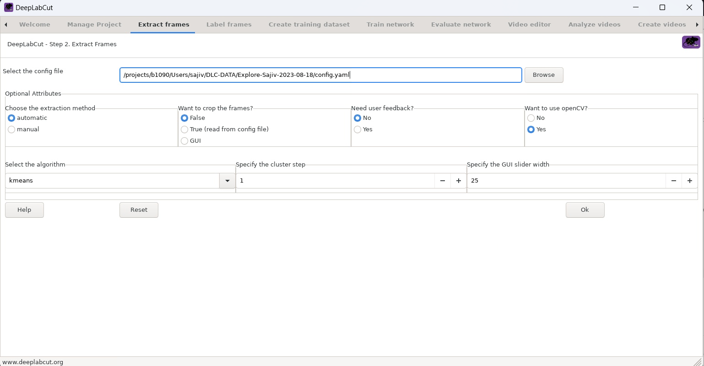
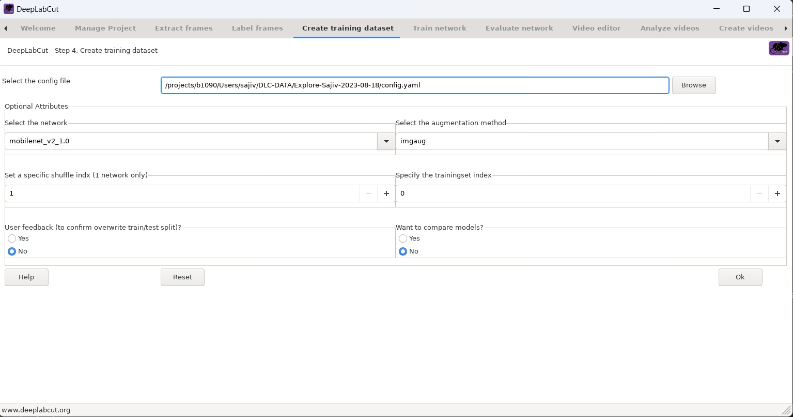

# NOR DLC Documentation
## Running DLC through Quest
* Download and use the FastX3 desktop client to connect to Quest
    * In-depth instructions can be found here: https://services.northwestern.edu/TDClient/30/Portal/KB/ArticleDet?ID=1511
* In FastX3, launch "GNOME terminal" app and run the following commands:0
```srun --x11  --gres=gpu:a100:1 --account=p32044 --partition=gengpu --mem=16G --nodes=1 --ntasks-per-node=1 -t 02:00:00 --pty bash -l```
    * Access to p32044 account is needed to complete this step
* To launch DeepLabCut GUI, run the following commands:
```$ module load deeplabcut/2.2.0.2```
 ```$ python3 -m deeplabcut```
    * These commands must be run every time a new quest session is started
 
## Creating a New Project:
* Navigate to the "Manage Project" tab
* Type in the project name, and experimenter name, and load all the videos that will be analyzed.
    * Create a folder with all the videos to make it easier
* Press on the "Edit Config File" option to open up the .yaml file
    * This file houses all the important information that is needed to train and test the model
    * Sample config file that has been filled out:
```bash=
# Project definitions (do not edit)
Task: Explore
scorer: Sajiv
date: Aug18
multianimalproject: false
identity:

    # Project path (change when moving around)
project_path: /projects/b1090/Users/sajiv/DLC-DATA/Explore-Sajiv-2023-08-18

    # Annotation data set configuration (and individual video cropping parameters)
video_sets:
  E:\Research\ApkarianLab\DeepLabCut\Explore-Sajiv-2023-08-18\videos\NOR10_Acq_R14.mp4:
    crop: 0, 852, 0, 480
  E:\Research\ApkarianLab\DeepLabCut\Explore-Sajiv-2023-08-18\videos\NOR10_Acq_R12.mp4:
    crop: 0, 852, 0, 480
  E:\Research\ApkarianLab\DeepLabCut\Explore-Sajiv-2023-08-18\videos\NOR10_Acq_R10.mp4:
    crop: 0, 852, 0, 480
  E:\Research\ApkarianLab\DeepLabCut\Explore-Sajiv-2023-08-18\videos\NOR10_Acq_R8.mp4:
    crop: 0, 852, 0, 480
  E:\Research\ApkarianLab\DeepLabCut\Explore-Sajiv-2023-08-18\videos\NOR10_Acq_R6.mp4:
    crop: 0, 852, 0, 480
  E:\Research\ApkarianLab\DeepLabCut\Explore-Sajiv-2023-08-18\videos\NOR10_Acq_R4.mp4:
    crop: 0, 852, 0, 480
  E:\Research\ApkarianLab\DeepLabCut\Explore-Sajiv-2023-08-18\videos\NOR10_Acq_R15.mp4:
    crop: 0, 852, 0, 480
  E:\Research\ApkarianLab\DeepLabCut\Explore-Sajiv-2023-08-18\videos\NOR10_Acq_R13.mp4:
    crop: 0, 852, 0, 480
  E:\Research\ApkarianLab\DeepLabCut\Explore-Sajiv-2023-08-18\videos\NOR10_Acq_R11.mp4:
    crop: 0, 852, 0, 480
  E:\Research\ApkarianLab\DeepLabCut\Explore-Sajiv-2023-08-18\videos\NOR10_Acq_R9.mp4:
    crop: 0, 852, 0, 480
  E:\Research\ApkarianLab\DeepLabCut\Explore-Sajiv-2023-08-18\videos\NOR10_Acq_R7.mp4:
    crop: 0, 852, 0, 480
  E:\Research\ApkarianLab\DeepLabCut\Explore-Sajiv-2023-08-18\videos\NOR10_Acq_R5.mp4:
    crop: 0, 852, 0, 480
  E:\Research\ApkarianLab\DeepLabCut\Explore-Sajiv-2023-08-18\videos\NOR10_Acq_R3.mp4:
    crop: 0, 852, 0, 480
  E:\Research\ApkarianLab\DeepLabCut\Explore-Sajiv-2023-08-18\videos\NOR10_Acq_R2.mp4:
    crop: 0, 852, 0, 480
  E:\Research\ApkarianLab\DeepLabCut\Explore-Sajiv-2023-08-18\videos\NOR10_Acq_R1.mp4:
    crop: 0, 852, 0, 480
bodyparts:
- Nose
- RightEar
- LeftEar
- Neck
- Back
- Tail

    # Fraction of video to start/stop when extracting frames for labeling/refinement
start: 0
stop: 1
numframes2pick: 20

    # Plotting configuration
skeleton:
- - Nose
  - RightEar
- - Neck
  - Back
- - LeftEar
  - Neck
- - Back
  - Tail
- - Nose
  - LeftEar
- - RightEar
  - Neck
skeleton_color: black
pcutoff: 0.6
dotsize: 3
alphavalue: 0.7
colormap: rainbow

    # Training,Evaluation and Analysis configuration
TrainingFraction:
- 0.95
iteration: 0
default_net_type: resnet_50
default_augmenter: default
snapshotindex: -1
batch_size: 8

    # Cropping Parameters (for analysis and outlier frame detection)
cropping: false
    #if cropping is true for analysis, then set the values here:
x1: 0
x2: 640
y1: 277
y2: 624

    # Refinement configuration (parameters from annotation dataset configuration also relevant in this stage)
corner2move2:
- 50
- 50
move2corner: true
```
Note: the bodyparts and skeleton can be changed as desired
* If loading an existing project, select the appropriate option in the GUI

## Frame Extraction
* We will need to extract a certain number of frames from each video for labeling
    * The number of frames extracted can be changed in the config file by changing "numframes2pick". 20 frames is optimal
* Use the following settings in the "Extract Frames" tab of the GUI


* Check for the directory /labeled-data, found within your project directory. 
    * /labeled-data/ should house folders for each video with each folder having 20 frames(images)

## Labeling
* Click on the "Label Frames" tab within the GUI and load your project's config file
    * Will prompt another window to open
* Load the frames you would like to label
    * Right-click to label the body part that is selected (Look at the panel on the right)
    * To an already placed label, left-click and drag to the desired spot
    * Center-click to remove the label
* When labeling:
    * Be as accurate as possible with your labeling
    * If body part (s) cannot be seen clearly in a frame, move on to the next frame. It is better to leave a frame unlabelled compared to labeling it incorrectly
    * Make sure to save before moving on to the next frame
* Repeat this process till at least 200 frames (10 videos) have been labeled
    * The more frames labeled, the more accurate the model will be
* After labeling the 20 frames from a video, move on to the next set of 20 frames from the next video
    * At the start of every new video, make sure to see that the CollectedData_[name].csv file is created within the /labeled-data/[video_name]/ directory **AND** if the data is being logged properlly into the csv everytime labels are saved
    * If the .csv file is not created OR the data is not being logged properly, close out the labeling window and reopen
* THIS STEP IS TEDIOUS AND TAKES TIME. Grab some coffee, relax, and be patient!

## Training the Model
* Create a training dataset using the following settings:
* After creating the dataset, close out of the GUI and terminal. 
* Open the terminal again, and enter the following commands:
    ```$ module load deeplabcut/2.2.0.2```
    ```$ python3```
* Type ```import deeplabcut``` 
* Run ```deeplabcut.train_network(path_config_file, max_snapshots_to_keep=100, maxiters=1000000)```
    * Running this will start training the model and run iterations. 
    * This step will take some time, depending on the system's available memory and resources.
    * Stop the training whenever desired, the more iterations the better.

## Evaluating the Model 
* This step will help decide if you need to train the model more
* Run ```deeplabcut.evaluate_network(config_path,Shuffles=[1], plotting=True)```
    * This will create a .csv file within the /evaluation-result/ directory. 
    * Check the .csv for test error and other important data to help decide if the model should be trained more. 
    * A test error of anything less than 5 pixels is excellent

## Video Analysis and Labeled Videos
* Run ```deeplabcut.analyze_videos(config_path,[path_to_firstVideo], save_as_csv=True, videotype='.mp4')``` **and** ```deeplabcut.create_labeled_video(config_path,[path_to_first_video], videotype='.mp4', draw_skeleton = True)```
* This will produce a labeled video and CSV file with all the estimated data points of each body part
* If satisfied, use a bash script to produce all other labeled videos and .csv files:
```bash=
#!/bin/bash

jobs=/projects/b1090/Users/sajiv/DLC-DATA/jobs

if [ ! -e $jobs ]; then mkdir $jobs; echo "making output directory"; fi

for i in {2..18};
do

echo -e "import deeplabcut" >> $jobs/Analysis_Acq_${i}.py
echo -e "deeplabcut.analyze_videos('/projects/b1090/Users/sajiv/DLC-DATA/Explore-Sajiv-2023-08-18/config.yaml',['/projects/b1090/Users/sajiv/DLC-DATA/RatVideos/NOR10_Acq_R${i}.mp4'], save_as_csv=True, videotype='.mp4')" >> $jobs/Analysis_Acq_${i}.py
echo -e "deeplabcut.create_labeled_video('/projects/b1090/Users/sajiv/DLC-DATA/Explore-Sajiv-2023-08-18/config.yaml',['/projects/b1090/Users/sajiv/DLC-DATA/RatVideos/NOR10_Acq_R${i}.mp4'], videotype='.mp4', draw_skeleton = True)" >> $jobs/Analysis_Acq_${i}.py

echo  "#!/bin/bash
#SBATCH -A p32044
#SBATCH -p gengpu
#SBATCH -t 5:00:00
#SBATCH -N 1
#SBATCH --mem=0
#SBATCH --nodes=1
#SBATCH --output=$jobs/Analysis_Acq_${i}.out" > $jobs/Analysis_Acq_${i}.sh

echo " " >> $jobs/Analysis_Acq_${i}.sh

echo "module load deeplabcut/2.2.0.2" >> $jobs/Analysis_Acq_${i}.sh

echo "python3 $jobs/Analysis_Acq_${i}.py" >> $jobs/Analysis_Acq_${i}.sh

sbatch $jobs/Analysis_Acq_${i}.sh

done

for i in {1..18};
do

echo -e "import deeplabcut" >> $jobs/Analysis_Disc_${i}.py
echo -e "deeplabcut.analyze_videos('/projects/b1090/Users/sajiv/DLC-DATA/Explore-Sajiv-2023-08-18/config.yaml',['/projects/b1090/Users/sajiv/DLC-DATA/RatVideos/NOR10_Disc_R${i}.mp4'], save_as_csv=True, videotype='.mp4')" >> $jobs/Analysis_Disc_${i}.py
echo -e "deeplabcut.create_labeled_video('/projects/b1090/Users/sajiv/DLC-DATA/Explore-Sajiv-2023-08-18/config.yaml',['/projects/b1090/Users/sajiv/DLC-DATA/RatVideos/NOR10_Disc_R${i}.mp4'], videotype='.mp4', draw_skeleton = True)" >> $jobs/Analysis_Disc_${i}.py

echo  "#!/bin/bash
#SBATCH -A p32044
#SBATCH -p gengpu
#SBATCH -t 5:00:00
#SBATCH -N 1
#SBATCH --mem=0
#SBATCH --nodes=1
#SBATCH --output=$jobs/Analysis_Disc_${i}.out" > $jobs/Analysis_Disc_${i}.sh

echo " " >> $jobs/Analysis_Disc_${i}.sh

echo "module load deeplabcut/2.2.0.2" >> $jobs/Analysis_Disc_${i}.sh

echo "python3 $jobs/Analysis_Disc_${i}.py" >> $jobs/Analysis_Disc_${i}.sh

sbatch $jobs/Analysis_Disc_${i}.sh


done
``
