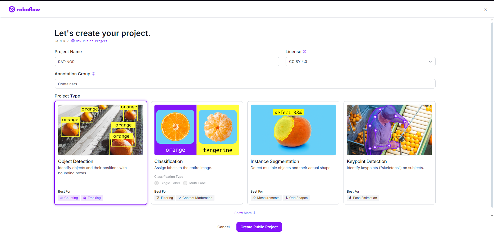
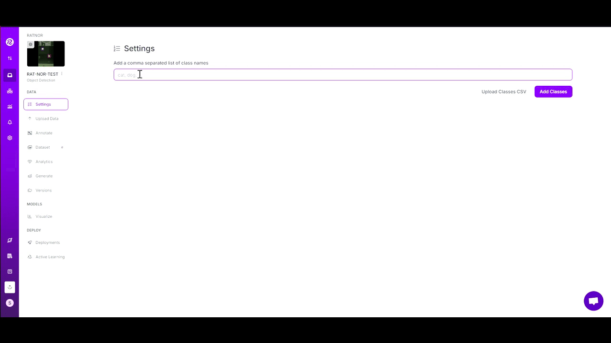
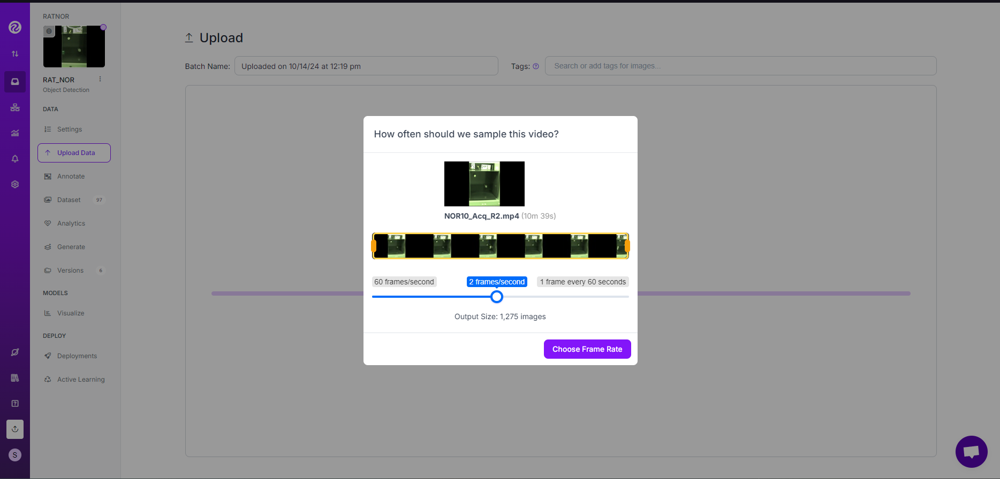
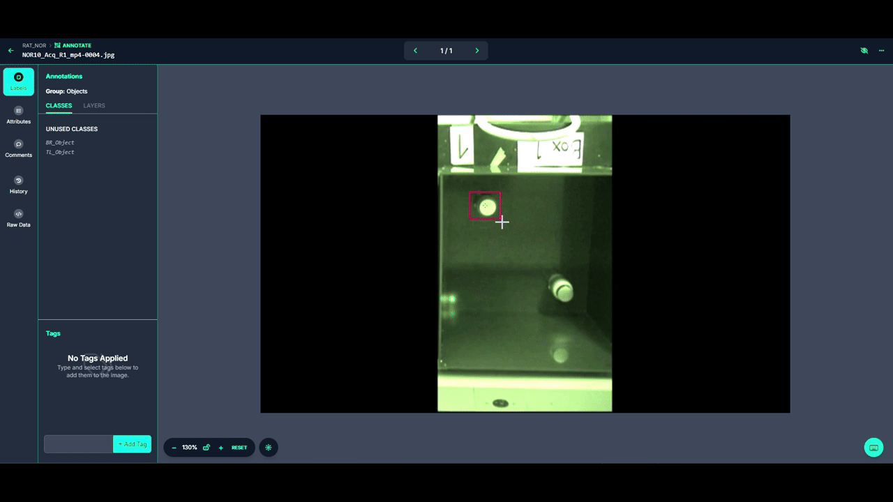
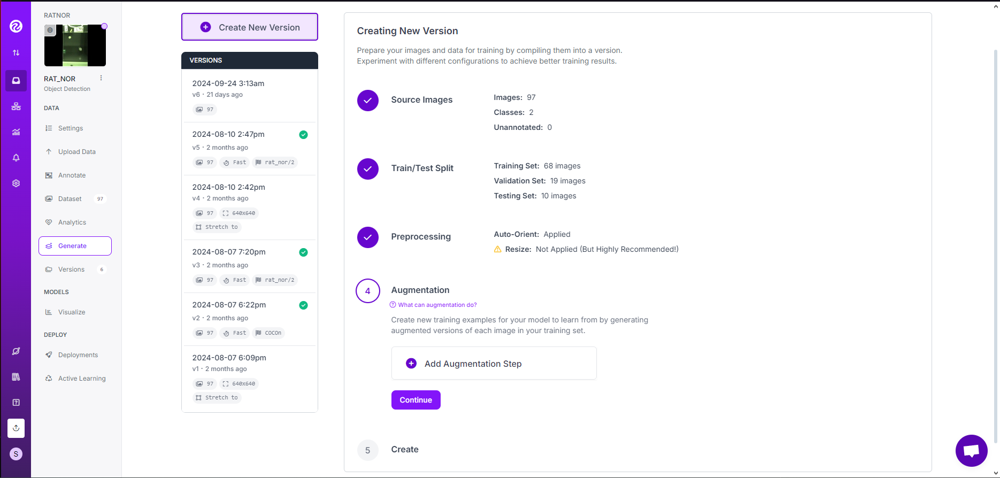
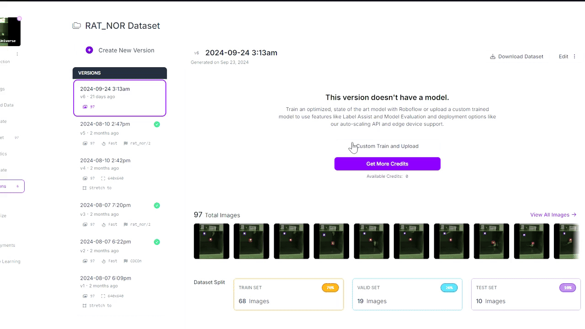

# ROBOFLOW Documentation
## Getting Started
* Navigate to  and sign-in or create new account 
* Create a workspace where all your projects will be saved (in this it will only be one project)
* Create a project and use the settings below
   * 
* In the "Setting" tab, type in the different objects you will be annotating
   * 

## Uploading videos and Frame Selection
* Navigate to the "Upload Data" tab in the left control panel
* Upload your videos (pick 2-3 videos from your dataset to annotate the objects)
* Select the number of images you like Roboflow to sample; pick enough images to train the model (Aim for 200-300 frames)
   * 

## Annotations
* Navigate to the "Annotations" tab and check for frames under "Unassigned"
* Click "Annotate Image"
* In the pop-up on the right-hand side, select "Start Manual Labeling"  
* Select the number of frames you would like to label (the more images labeled, the more accurate the model) and then "Assign to Myself"
    * Suggested Number of Frames to Label: 100-300
----
* Under "Annotating", Click "Start Annotating"
* Use the following example for annotating your images. Continue annotating till you exhaust your images.
   * 

## Model Generation and Exporting
* Navigate to the "Generate" tab and click "Create New Project"
* In "Pre-Processing" make sure to get rid of "Auto-Resize"
* There should be nothing in "Augmentation" (Remove if anything is present)
* Create the model

----
* Navigate to "Versions" and click on the most recent version
* Then click "Custom Train and Upload", select "YoloV9", click "Get Snippet", and copy the Snippet
  
* This snippet will be needed in the next step:
